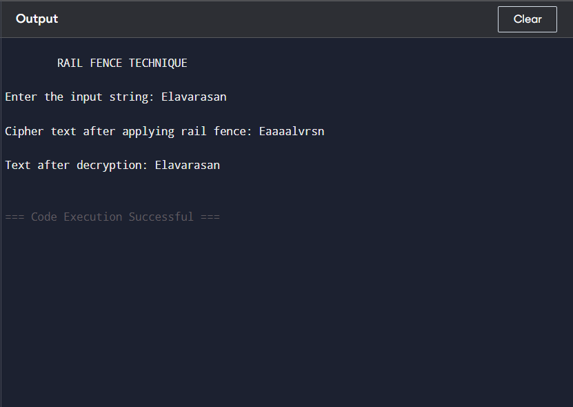

# Ex-4 Rail-Fence-Program

# IMPLEMENTATION OF RAIL FENCE – ROW & COLUMN TRANSFORMATION TECHNIQUE

# AIM:

# To write a C program to implement the rail fence transposition technique.

# DESCRIPTION:

In the rail fence cipher, the plain text is written downwards and diagonally on successive "rails" of an imaginary fence, then moving up when we reach the bottom rail. When we reach the top rail, the message is written downwards again until the whole plaintext is written out. The message is then read off in rows.

# ALGORITHM:

STEP-1: Read the Plain text.
STEP-2: Arrange the plain text in row columnar matrix format.
STEP-3: Now read the keyword depending on the number of columns of the plain text.
STEP-4: Arrange the characters of the keyword in sorted order and the corresponding columns of the plain text.
STEP-5: Read the characters row wise or column wise in the former order to get the cipher text.

# PROGRAM

```c
#include <stdio.h>
#include <string.h>
int main()
{
    int i, j, k, l;
    char a[20], c[20], d[20];
    printf("\n\t\tRAIL FENCE TECHNIQUE\n");
    // Safely getting input string using fgets instead of gets
    printf("\nEnter the input string: ");
    fgets(a, sizeof(a), stdin);
    // Removing the newline character if it exists
    a[strcspn(a, "\n")] = '\0';
    l = strlen(a); // Get the length of the input string
    // Rail fence encryption: first collect even indices, then odd
    for (i = 0, j = 0; i < l; i++)
    {
        if (i % 2 == 0)
        {
            c[j++] = a[i];
        }
    }
    for (i = 0; i < l; i++)
    {
        if (i % 2 == 1)
        {
            c[j++] = a[i];
        }
    }
    c[j] = '\0'; // Null-terminate the encrypted string
    printf("\nCipher text after applying rail fence: %s\n", c);
    // Rail fence decryption
    if (l % 2 == 0)
    {
        k = l / 2;
    }
    else
    {
        k = (l / 2) + 1;
    }
    // Reconstructing the original text
    for (i = 0, j = 0; i < k; i++)
    {
        d[j] = c[i];
        j += 2;
    }
    for (i = k, j = 1; i < l; i++)
    {
        d[j] = c[i];
        j += 2;
    }
    d[l] = '\0'; // Null-terminate the decrypted string
    printf("\nText after decryption: %s\n", d);
    return 0; // Properly return from main
}

```

# OUTPUT



# RESULT
